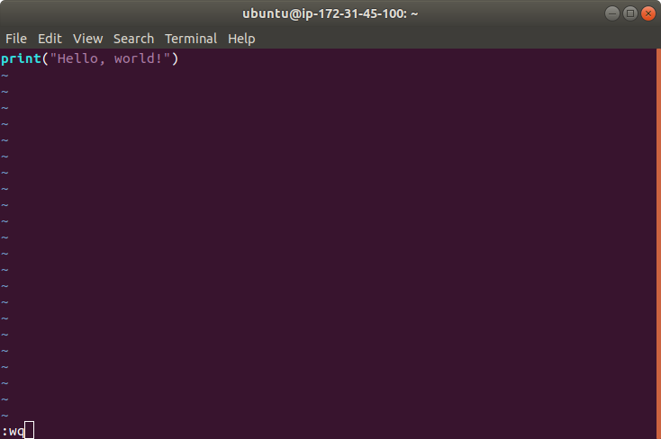
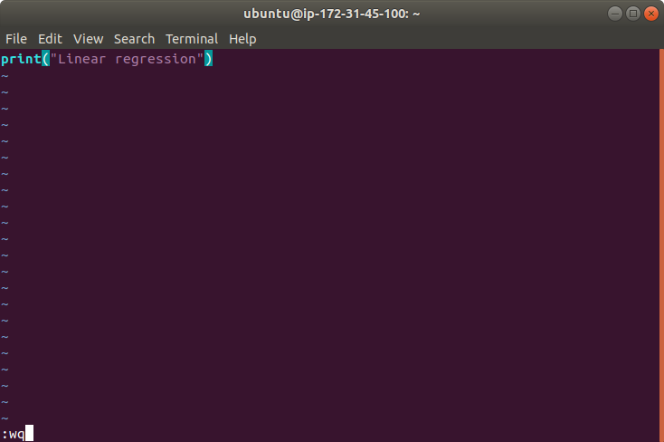

## Урок 3

### 1. С помощью текстового редактора Vim создать файл с программой на Python, выводящей текст Hello, world!

```sh
ubuntu@ip-172-31-45-100:~$ vi hello.py
```

```sh
ubuntu@ip-172-31-45-100:~$ cat hello.py 
print("Hello, world!")
ubuntu@ip-172-31-45-100:~$ python3 hello.py 
Hello, world!
ubuntu@ip-172-31-45-100:~$ cat hello.py 
print("Hello, world!")
```


### 2. Запустить команду, определяющую число строк в файле.

```sh
ubuntu@ip-172-31-45-100:~$ wc -l hello.py 
1 hello.py
```

### 3. Создать еще один файл с командой на Python, выводящей текст Linear regression.

```sh
ubuntu@ip-172-31-45-100:~$ vi linear_regression.py
```

```sh
ubuntu@ip-172-31-45-100:~$ cat linear_regression.py 
print("Linear regression")
ubuntu@ip-172-31-45-100:~$ python3 linear_regression.py 
Linear regression
```

### 4. Объединить эти два файла с помощью команды cat.

```sh
ubuntu@ip-172-31-45-100:~$ cat hello.py linear_regression.py 
print("Hello, world!")
print("Linear regression")
ubuntu@ip-172-31-45-100:~$ cat hello.py linear_regression.py > join.py
ubuntu@ip-172-31-45-100:~$ cat join.py 
print("Hello, world!")
print("Linear regression")
ubuntu@ip-172-31-45-100:~$ python3 join.py 
Hello, world!
Linear regression
```

### 5. Придумать три случая применения команды cat для работы с текстовыми файлами.

1. Отображение содержимого файла

```sh
ubuntu@ip-172-31-45-100:~$ cat join.py 
print("Hello, world!")
print("Linear regression")
```

2. Объединение содержимого двух файлов (или создание нового файла на их основе)

```sh
ubuntu@ip-172-31-45-100:~$ cat linear_regression.py hello.py 
print("Linear regression")
print("Hello, world!")
```

3. Передача содержимого файла в качестве параметра для какой-либо команды оболочки

```sh
ubuntu@ip-172-31-45-100:~$ echo '/home/ubuntu' > cur_dir.txt
ubuntu@ip-172-31-45-100:~$ cat cur_dir.txt 
/home/ubuntu
ubuntu@ip-172-31-45-100:~$ cat cur_dir.txt | ls
cur_dir.txt  hello.py  join.py  linear_regression.py
```
