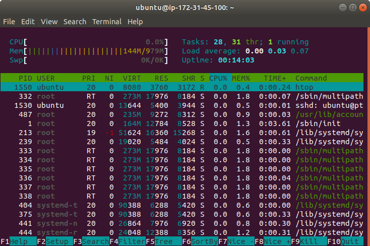
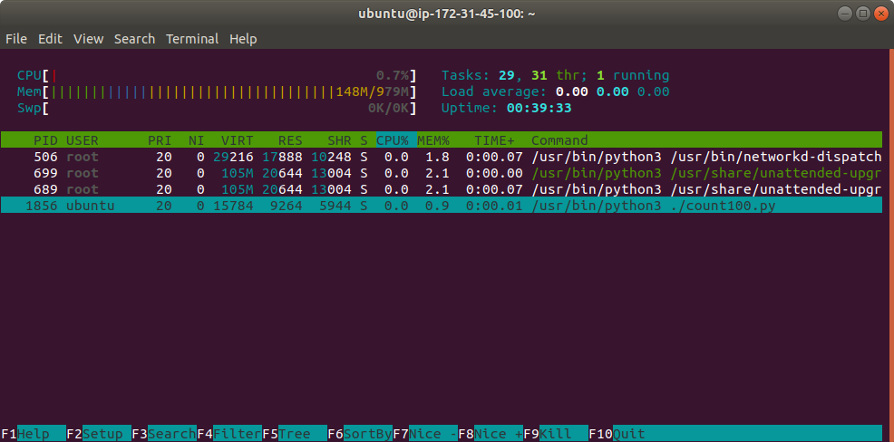

## Урок 5

### 1. Запустить htop и посмотреть, сколько процессоров и оперативной памяти есть на сервере.

```sh
ubuntu@ip-172-31-45-100:~$ apt policy htop
htop:
  Installed: 2.2.0-2build1
  Candidate: 2.2.0-2build1
  Version table:
 *** 2.2.0-2build1 500
        500 http://us-east-2.ec2.archive.ubuntu.com/ubuntu focal/main amd64 Packages
        100 /var/lib/dpkg/status
```


Процессоров: 1

Оперативной памяти: 979M


### 2. Найти все программы с расширением .py.

```sh
ubuntu@ip-172-31-45-100:~$ find / -type f -name '*.py' 2>/dev/null > py.files.lst
$ scp -i ~/.ssh/aws_key.pem ubuntu@3.16.159.190:/home/ubuntu/py.files.lst ./
py.files.lst                                  100%  629KB 432.6KB/s   00:01 
```
<details>
    <summary>py.files.lst</summary>

```
/home/user_new/count10.py
/home/ubuntu/hello.py
/home/ubuntu/join.py
/home/ubuntu/linear_regression.py
/snap/lxd/15753/lib/python2.7/BaseHTTPServer.py
/snap/lxd/15753/lib/python2.7/Bastion.py
/snap/lxd/15753/lib/python2.7/CGIHTTPServer.py
/snap/lxd/15753/lib/python2.7/ConfigParser.py
/snap/lxd/15753/lib/python2.7/Cookie.py
/snap/lxd/15753/lib/python2.7/DocXMLRPCServer.py
/snap/lxd/15753/lib/python2.7/HTMLParser.py
/snap/lxd/15753/lib/python2.7/MimeWriter.py
/snap/lxd/15753/lib/python2.7/Queue.py
/snap/lxd/15753/lib/python2.7/SimpleHTTPServer.py
/snap/lxd/15753/lib/python2.7/SimpleXMLRPCServer.py
/snap/lxd/15753/lib/python2.7/SocketServer.py
/snap/lxd/15753/lib/python2.7/StringIO.py
/snap/lxd/15753/lib/python2.7/UserDict.py
/snap/lxd/15753/lib/python2.7/UserList.py
/snap/lxd/15753/lib/python2.7/UserString.py
/snap/lxd/15753/lib/python2.7/_LWPCookieJar.py
...
```
</details>


### 3. * Создать и запустить программу на Python, выводящую числа от 0 до 100 включительно.

```sh
ubuntu@ip-172-31-45-100:~$ vi count100.py
ubuntu@ip-172-31-45-100:~$ cat count100.py 
#!/usr/bin/python3

from time import sleep

for i in range(101):
    print(i)
    sleep(1)
ubuntu@ip-172-31-45-100:~$ chmod u+x count100.py
ubuntu@ip-172-31-45-100:~$ ./count100.py > /dev/null &
[1] 1856
```

### Запустить htop во время выполнения программы и найти выполняемую программу в списке процессов, используя поиск по ключевому слову python (использовать средства поиска htop).

```sh
ubuntu@ip-172-31-45-100:~$ htop

```

