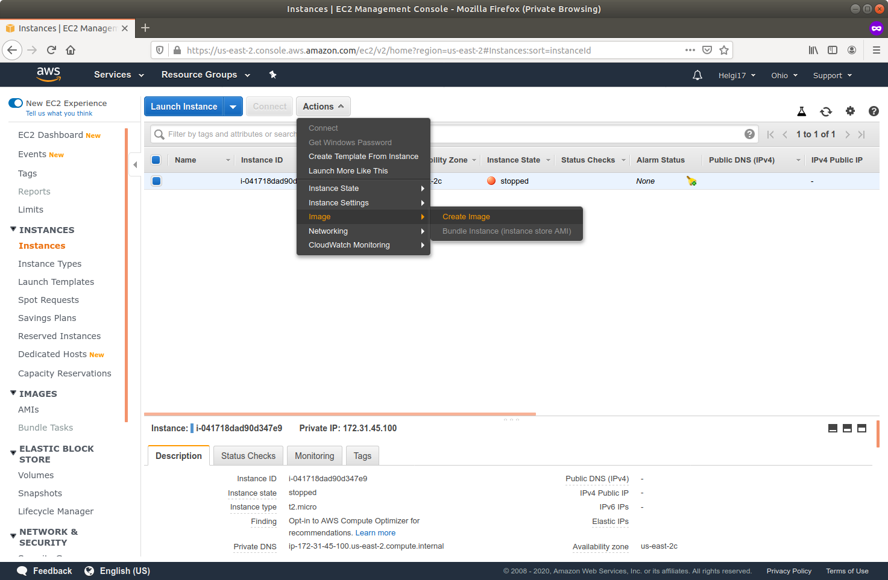

```sh
ubuntu@ip-172-31-45-100:~$ apt policy python3-pip
python3-pip:
  Installed: (none)
  Candidate: 20.0.2-5ubuntu1
  Version table:
     20.0.2-5ubuntu1 500
        500 http://us-east-2.ec2.archive.ubuntu.com/ubuntu focal/universe amd64 Packages
```
```sh
ubuntu@ip-172-31-45-100:~$ apt policy python3-pip
python3-pip:
  Installed: 20.0.2-5ubuntu1
  Candidate: 20.0.2-5ubuntu1
  Version table:
 *** 20.0.2-5ubuntu1 500
        500 http://us-east-2.ec2.archive.ubuntu.com/ubuntu focal/universe amd64 Packages
        100 /var/lib/dpkg/status
```

### 1. Создать AMI на основе имеющегося у вас инстанса.




### 2. Создать новый инстанс на основе AMI, сделанного в предыдущем задании. Проверить, присутствуют ли на новом инстансе программы, установленные на исходном инстансе.


```sh
ubuntu@ip-172-31-25-129:~$ apt policy python3-pip
python3-pip:
  Installed: 20.0.2-5ubuntu1
  Candidate: 20.0.2-5ubuntu1
  Version table:
 *** 20.0.2-5ubuntu1 500
        500 http://us-east-2.ec2.archive.ubuntu.com/ubuntu focal/universe amd64 Packages
        100 /var/lib/dpkg/status

```

### 3. Добавить новый диск к используемому инстансу. Проверить доступ к этому диску и создать на нем текстовый файл test.txt, содержащий слово test. Затем создать новый инстанс, отсоединить диск от старого и подсоединить к новому. Проверить наличие на диске файла test.txt и просмотреть его в текстовом редакторе nano.


Подключаем диск к первому экземпляру

```sh
ubuntu@ip-172-31-45-100:~$ lsblk
NAME    MAJ:MIN RM  SIZE RO TYPE MOUNTPOINT
loop0     7:0    0   18M  1 loop /snap/amazon-ssm-agent/1566
loop1     7:1    0 28.1M  1 loop /snap/amazon-ssm-agent/2012
loop2     7:2    0   97M  1 loop /snap/core/9289
loop3     7:3    0 96.5M  1 loop /snap/core/9436
loop4     7:4    0   55M  1 loop /snap/core18/1705
loop5     7:5    0   55M  1 loop /snap/core18/1754
loop6     7:6    0 71.3M  1 loop /snap/lxd/15753
loop7     7:7    0 71.2M  1 loop /snap/lxd/15896
xvda    202:0    0    8G  0 disk 
└─xvda1 202:1    0    8G  0 part /
xvdf    202:80   0    1G  0 disk 
ubuntu@ip-172-31-45-100:~$ sudo mkdir /data
ubuntu@ip-172-31-45-100:~$ sudo mkfs -t ext4 /dev/xvd
/dev/xvda   /dev/xvda1  /dev/xvdf   
ubuntu@ip-172-31-45-100:~$ sudo mkfs -t ext4 /dev/xvd
/dev/xvda   /dev/xvda1  /dev/xvdf   
ubuntu@ip-172-31-45-100:~$ sudo mkfs -t ext4 /dev/xvdf
mke2fs 1.45.5 (07-Jan-2020)
Creating filesystem with 262144 4k blocks and 65536 inodes
Filesystem UUID: 7cfc89be-269a-42b3-b2b1-8cd13e00f04b
Superblock backups stored on blocks: 
	32768, 98304, 163840, 229376

Allocating group tables: done                            
Writing inode tables: done                            
Creating journal (8192 blocks): done
Writing superblocks and filesystem accounting information: done

ubuntu@ip-172-31-45-100:~$ sudo mount /dev/xvdf /data
ubuntu@ip-172-31-45-100:~$ df
Filesystem     1K-blocks    Used Available Use% Mounted on
/dev/root        8065444 2349776   5699284  30% /
devtmpfs          488748       0    488748   0% /dev
tmpfs             501052       0    501052   0% /dev/shm
tmpfs             100212     792     99420   1% /run
tmpfs               5120       0      5120   0% /run/lock
tmpfs             501052       0    501052   0% /sys/fs/cgroup
/dev/loop0         18432   18432         0 100% /snap/amazon-ssm-agent/1566
/dev/loop1         28800   28800         0 100% /snap/amazon-ssm-agent/2012
/dev/loop2         99456   99456         0 100% /snap/core/9289
/dev/loop3         98944   98944         0 100% /snap/core/9436
/dev/loop4         56320   56320         0 100% /snap/core18/1705
/dev/loop5         56320   56320         0 100% /snap/core18/1754
/dev/loop6         72960   72960         0 100% /snap/lxd/15753
/dev/loop7         72960   72960         0 100% /snap/lxd/15896
tmpfs             100208       0    100208   0% /run/user/1000
/dev/xvdf         999320    2564    927944   1% /data

ubuntu@ip-172-31-45-100:~$ sudo groupadd data-users
ubuntu@ip-172-31-45-100:~$ sudo usermod -G data-users ubuntu
ubuntu@ip-172-31-45-100:~$ sudo chown root:data-users -R /data
ubuntu@ip-172-31-45-100:~$ ls -l / | grep data
drwxr-xr-x   3 root data-users  4096 Jul  1 20:55 data
ubuntu@ip-172-31-45-100:~$ sudo chmod g+w -R /data
test

```

Для применения прав для записи потребовалось перелогиниться. Возможно, есть другой способ, но нашелся только этот.

```sh
ubuntu@ip-172-31-45-100:~$ echo 'test' > /data/test.txt
ubuntu@ip-172-31-45-100:~$ cat /data/test.txt 
test
ubuntu@ip-172-31-45-100:~$ sudo umount /data

```

На другом запущенном экземпляре
```sh
ubuntu@ip-172-31-32-20:~$ sudo mkdir /data
ubuntu@ip-172-31-32-20:~$ lsblk
NAME    MAJ:MIN RM  SIZE RO TYPE MOUNTPOINT
loop0     7:0    0   18M  1 loop /snap/amazon-ssm-agent/1566
loop1     7:1    0 28.1M  1 loop /snap/amazon-ssm-agent/2012
loop2     7:2    0 96.5M  1 loop /snap/core/9436
loop3     7:3    0   97M  1 loop /snap/core/9289
loop4     7:4    0   55M  1 loop /snap/core18/1705
loop5     7:5    0   55M  1 loop /snap/core18/1754
loop6     7:6    0 71.3M  1 loop /snap/lxd/15753
loop7     7:7    0 71.2M  1 loop /snap/lxd/15896
xvda    202:0    0    8G  0 disk 
└─xvda1 202:1    0    8G  0 part /
xvdf    202:80   0    1G  0 disk 
ubuntu@ip-172-31-32-20:~$ sudo groupadd data-users
ubuntu@ip-172-31-32-20:~$ sudo usermod -G data-users ubuntu
ubuntu@ip-172-31-32-20:~$ sudo chown root:data-users -R /data
ubuntu@ip-172-31-32-20:~$ sudo mount /dev/xvdf /data
ubuntu@ip-172-31-32-20:~$ ls /data
lost+found  test.txt
ubuntu@ip-172-31-32-20:~$ cat /data/test.txt 
test
```

